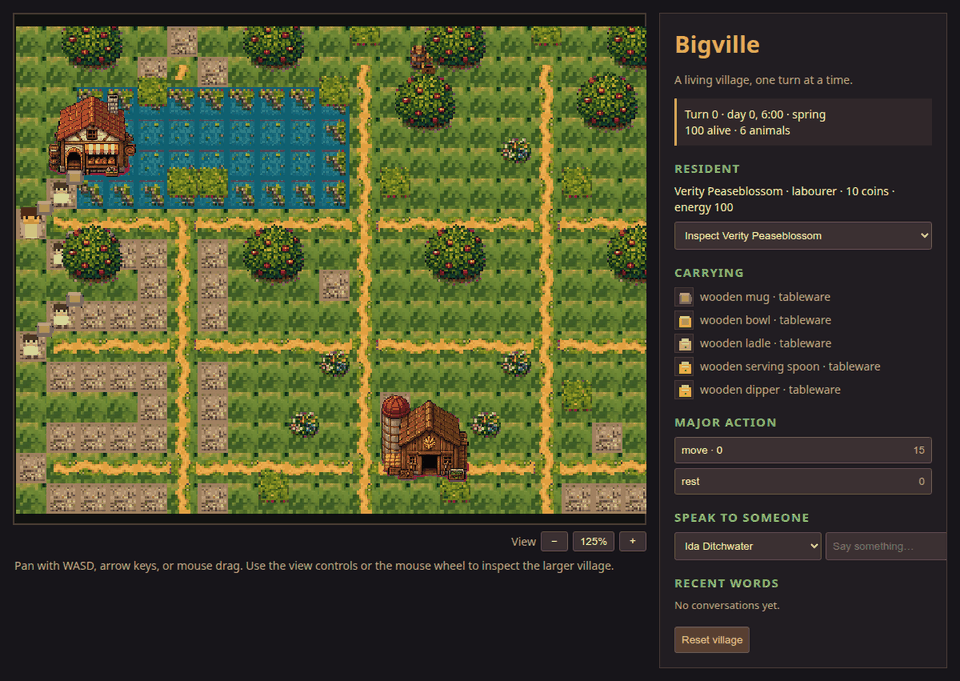
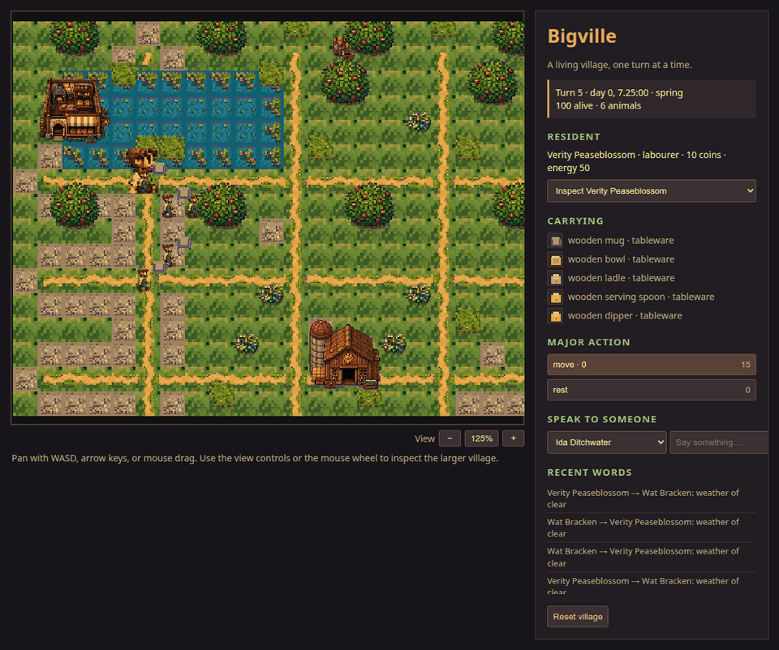

# Bigville

Bigville is a data-driven village simulation and game API. The canonical world
contains a map, residents, bodies, animals, farms, buildings, food production,
trade, storage, law, records, observations, affordances, and seeded resident
cognition. Actors are driven through a backend boundary: Ocelot, a human UI,
the deterministic game backend, or a future LLM backend can all propose the
same validated actions.

The public API is in `bigville/`:

```python
from bigville import create_game

game = create_game(player="Ada", default_backend="cheap")
state = game.step()
```

Bigville is standalone: its graph runtime, world mechanics, seed data, backend
protocol, persistence model, and tests are all in this repository. Cognition
providers may be embedded, remote, deterministic, human-driven, or backed by
another project; none is required to run the simulation.

## Play the village

The repository includes a playable Phaser 3 browser client. It uses the
canonical Python world over a small standard-library HTTP API.

```bash
python -m pip install -e .
python -m bigville.server
# open http://127.0.0.1:8765/
```

The hand-pixeled village scene in `bigville/game/assets/village_scene.png` and
the supporting sprite/icon sheets are included in the package. Use the action
buttons to submit a major action, or speak to another resident;
autonomous deterministic residents take their own backend decisions on the
same turn.

### Screenshots






The animation is produced from a live run of the client and backend:

```bash
python tools/record_game.py --turns 24
```

The recorder requires the optional local tools `playwright` and `Pillow`, plus
a Chromium-compatible browser.

Occupied buildings are rendered as open-roof rooms, so residents and their
interiors remain visible while the village continues to run.

## Cognition backends

`DeterministicBackend` is the cheap, repeatable game backend. `LLMBackend` is a
provider-neutral adapter: pass an object with `complete(prompt)` and it will
receive a versioned JSON prompt containing the character state, public
observations, world frames, legal affordances, and recipient capabilities.
The provider returns a JSON `ActorResponse`.

## Development

```bash
python -m pip install -e .
python -m pytest -q
```

The backend and prompt work is staged in
[`docs/AGENT_BACKENDS_PLAN.md`](docs/AGENT_BACKENDS_PLAN.md).
